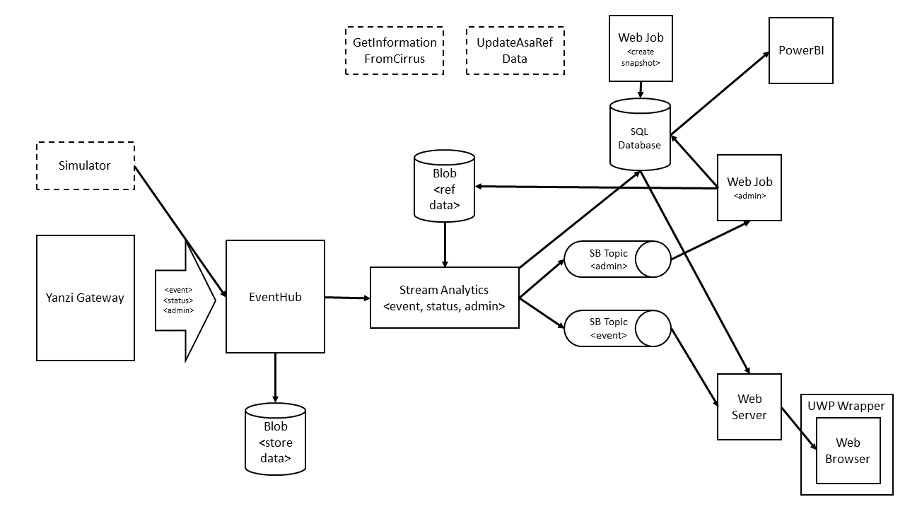

# Architecture

This is a deeper description of the aolutions architecture.

## Event Hub
Yanzi Networks has a Gateway that transfer all messages (in their system called Samples) into
Azure, using a [Event Hub](https://azure.microsoft.com/en-us/documentation/services/event-hubs/). 
(We could also have used an [IoT Hub](https://azure.microsoft.com/en-us/documentation/services/iot-hub/), but we don't need device management or
Commands in version 1.0 of this solution.)

The Event Hub stores all incomming messages into [Azure Blobs](https://azure.microsoft.com/en-us/documentation/services/storage/). (This is not used today. It will be used 
to transfered data into Big Data Analysis in the future.)

## Stream Analytics
We have a [Stream Analytics](https://azure.microsoft.com/en-us/documentation/services/stream-analytics/) job that convert and transfer the incomming messages from Yanzi to four
outputs:

1.  Two outputs into [SQL Database](https://azure.microsoft.com/en-us/documentation/services/sql-database/).
2.  A [Service Bus Topic](https://azure.microsoft.com/en-us/documentation/articles/service-bus-dotnet-how-to-use-topics-subscriptions/) that the Web Server is listening to and is used to update the
realtime floor map.
3.  A Service Bus Topic that transfer all admin messages to a Web Job that updates 
reference data in SQL Database.

An Azure Blob is also used as an input to Stream Analytics. It contains more information about
the sensors and is used by joining it with the stream.

## SQL Database
The database is used for two things. 

1.  Store Reference Data about all sensors (Assets)
2.  Be the source to PowerBI reports.

### Tables
Three tables are mainly used in the database.

1.  **Asset** - The information about the sensors
2.  **LastKnownSampleStatus** - Contains the latest sample from each sensor
3.  **Samples** - The samples history

## Web Jobs
### Create Snapshot (webjob-snapshot-sql)
This [web job](https://azure.microsoft.com/en-us/documentation/articles/app-service-webjobs-readme/) is executed on a schedule every 10th minute and it does a snapshot of the 
status in the table **LastKnownSampleStatus** and store that information in **Samples**. 
This is the best way, in this solution to store datapoints every 10th minute. This is the
data resolution that we need.
> This is the easiest way to implement a SQL Agent work.

### Admin (webjob-admin-worker)
It listen to admin messages from the Admin Service Bus Topic and updates the table **Asset**
accordingly.

## Web Application
A [Web App](https://azure.microsoft.com/en-us/documentation/services/app-service/web/) is used to view the realtime display of a floor. When it starts, it first
get the current status of all Assets from SQL Database and then starts listening on
the Service Bus Topic.

It uses Web Sockets ([SignalR](http://signalr.net/)) to communicate with the browser. The floor map is stored as a
SVG file and is updated with Javascript.

## Universal Windows Platform App
An App is created that host the web site and the app is installed on a Raspberry PI, running
Windows IoT Core.

## GetInformationFromCirrus
This is a Windows Console Application that get sensor information from Yanzi (their api is called
Cirrus) and sends it to the Admin Service Bus Topic. 

This is a temporary solution and is right now used to get it to work until Yanzi has 
implemented support for admin messages.

## UpdateAsaRefData
This is a Windows Console Application that creates a Reference Blob that Stream Analytics 
uses. 

This is a temporary solution right now.

## Simulator
The simulator has two responsibilites. It initialize the solution with sensor data and it simulate messages from the Yanzi Gateway.
