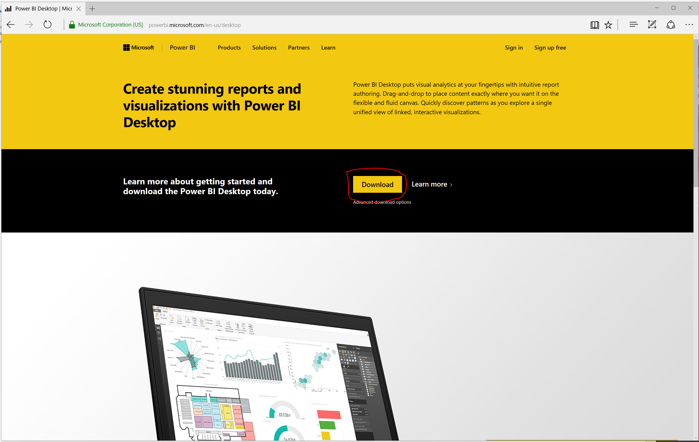
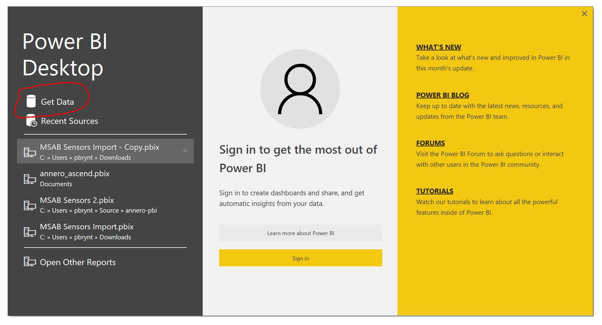
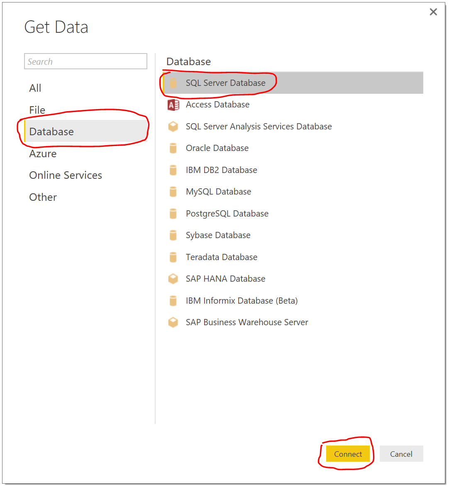
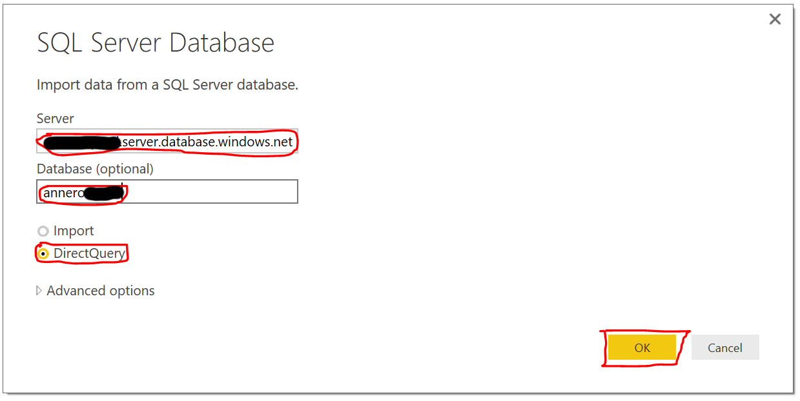
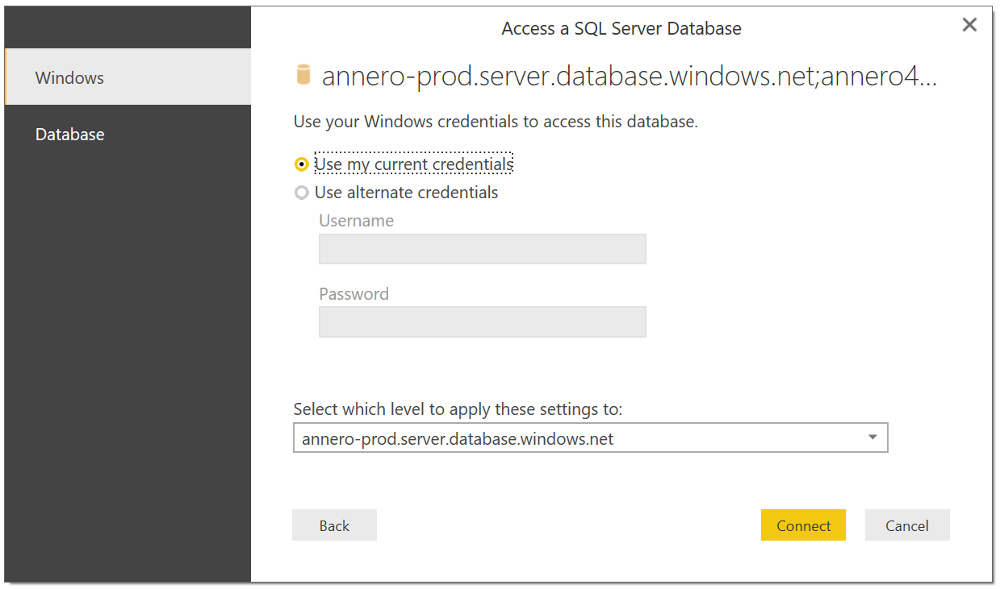
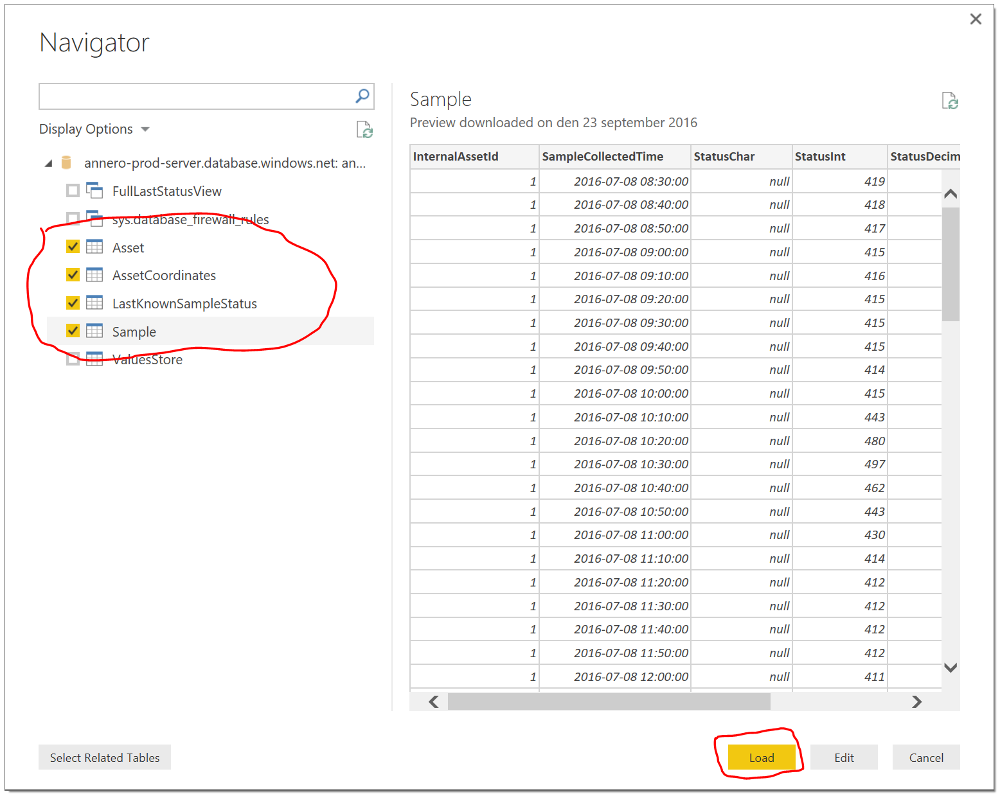
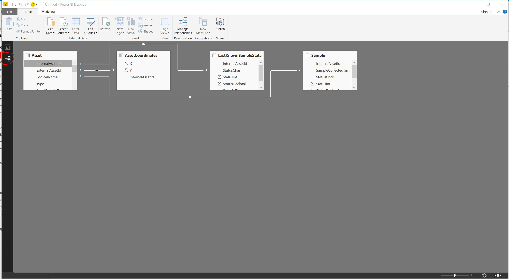
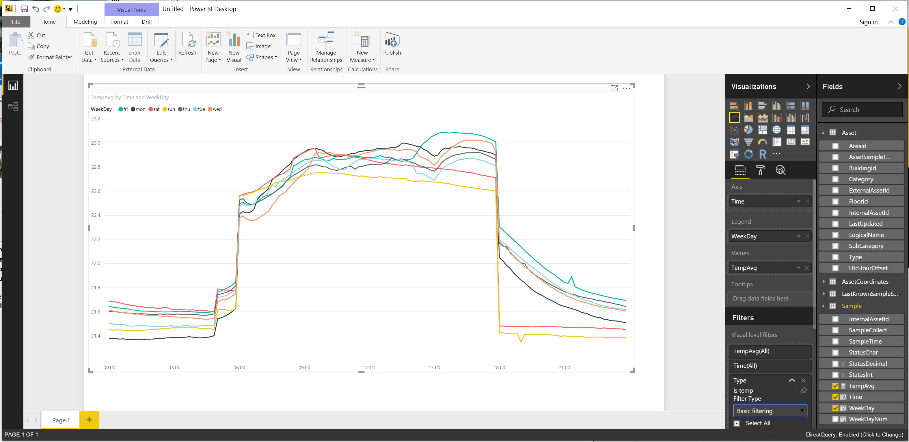

# How-to get PowerBI up and running on your IoT data

First, let’s make sure you have PowerBI Desktop installed. If you don’t, surf up to [https://powerbi.microsoft.com/en-us/desktop/](https://powerbi.microsoft.com/en-us/desktop/) 
and click the download button.

Once download, start PowerBI and click the Get Data menu option.

Make sure you select Database and the SQL Server Database options. Press the Connect button.

Type in your server name and the database name. Here you can also choose between working 
with a local copy of the data or if you want to use the DirectQuery mode, where data is 
fetched from the database when needed. Both modes has it’s advantages – I’ve chosen 
DirectQuery here. Press the OK button when done.

In the next screen you need to supply your login credentials. After you have 
supplied to correct you will press Connect. If that fails and you are running 
against a Azure SQL database – please make sure that you have opened the 
firewall on your database for your local IP adress.

Once successfully connected you will be presented with a screen where you can 
choose which tables to work with in PowerBI. We are only interested in 
the 4 main ones right now, which is:

* **Asset** - Describes all the assets (or sensors) that supplies data.
* **AssetCoordinates** - Has the X,Y coordinates for the sensors on a architectural drawing. 
This will probably not be so interesting for most users. (This table is not included in the
simulated solution.)
*	**LastKnownSampleStatus** - This table always has the most recent status for the sensors.
*	**Sample** - This is the historical table for all readings. This is table to use for any 
visualization over time.

Select these four and press Load.

Once loaded, head over to Data relations view and set up the relation between the 
tables. It’s a very simple data model, all tables have a column called 
*InternalAssetId* and everyone relates to the Asset table. So set up your 
relations like this (drag and drop from the Asset table):

Now you are all set to start creating your own visualizations! 

We will do one example here, we want to see the temperature variations during a day, 
comparing the different days of the week. First of all we need to define a couple of 
new columns in the Sample table to help us visualize this. All of these are 
defined in the DAX scripting language. 

Highly recommended to learn this, it’s extremely powerful. 

Here are the columns we will add:
* WeekDayNum = WEEKDAY('Sample'[SampleCollectedTime];2)
* WeekDay = SWITCH([WeekDayNum]; 1; "mon"; 2; "tue"; 3; "wed"; 4; "thu"; 5; "fri"; 6; "sat"; 7; "sun")
* Time = TIME(HOUR([SampleCollectedTime]);MINUTE([SampleCollectedTime]);SECOND([SampleCollectedTime]))
* TempAvg = AVERAGE('Sample'[StatusDecimal])

Add them by right-clicking on the Sample table and choose ’New Column’ and then copy 
in from above. The last one (TempAvg) should be added as a measure, so choose the 
menu item ’New Measure’ for that one instead.
Drop in the relevant properties, filter on Type from Asset so we only show 
temperature sensors and then you will have something like this:

Happy visualing!

